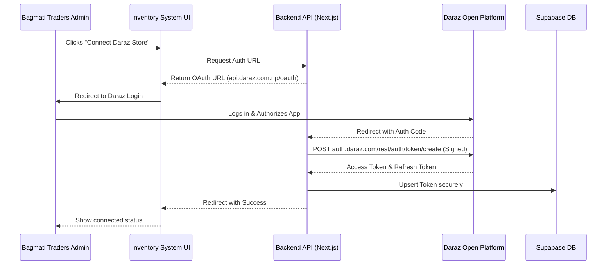
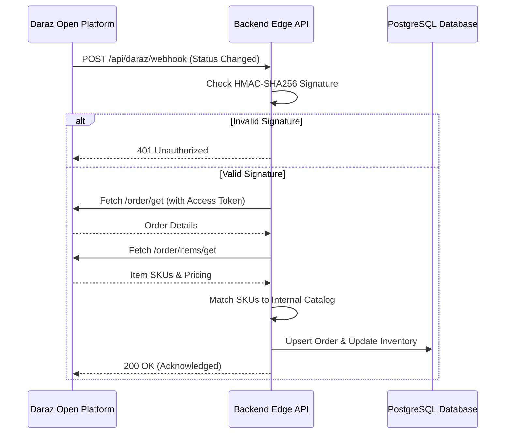
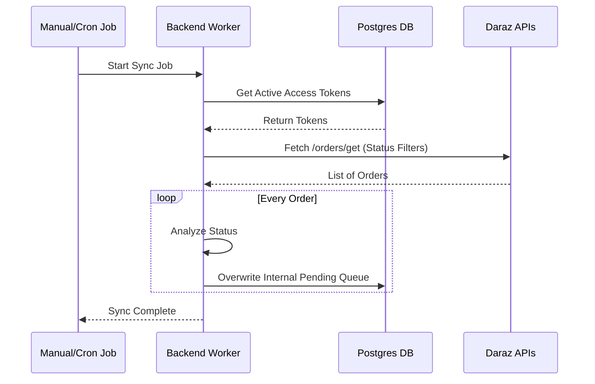

# Daraz Open Platform Application Approval Document

**Application Name:** Bagmati Traders Inventory Management App
**Company:** Bagmati Traders
**Purpose of Application:** Centralized Order, Inventory, and Financial Management

---

## 1. Business Reason & Justification for the App

**Background:**
Bagmati Traders operates a multi-channel retail and wholesale business, handling sales from physical storefronts, direct clients, and various online marketplaces, including our primary ecommerce channel, Daraz.

**The Problem:**
Currently, operating Daraz orders independently requires our team to manually transcribe orders, manage stock levels across disconnected software, and manually update tracking and return statuses. This manual process is prone to human error, causes delays in order fulfillment, and introduces the risk of overselling products since inventory is not synced in real-time.

**Why We Need API Access:**
This application is an internal, custom-built ERP (Enterprise Resource Planning) and Inventory Management system designed explicitly for Bagmati Traders. 
By integrating with the Daraz Open Platform API, we achieve:
1.  **Automated Order Fulfillment:** Direct ingestion of new Daraz orders into our central dispatch system alongside offline sales. 
2.  **Real-time Status Tracking:** Webhook integrations allow us to automatically track the status of customer returns, shipped packages, and delivered items for fast financial reconciliation without logging into the Seller Center manually.
3.  **Data Consistency:** Ensure accurate item mapping between Daraz SKUs and internal product IDs to prevent stockouts and overselling.
4.  **Expedited Customer Service:** Our team can see the exact, real-time status of any Daraz order directly from our centralized dashboard, decreasing response times and improving the customer experience on Daraz.

We are requesting "Go Live" (Online) status exclusively for our own seller accounts to streamline our backend operations and improve our Daraz seller performance metrics (e.g., faster "Ready to Ship" times).

---

## 2. Design Documentation & Data Flow Diagram

### 2.1 System Architecture Overview

The system consists of three main components:
1.  **Frontend (Next.js/React):** The user interface where our dispatch and finance teams operate.
2.  **Backend API (Next.js Edge/Server Functions):** Serves as a secure middleware that securely signs and handles all requests to the Daraz Open Platform APIs. 
3.  **Database (Supabase/PostgreSQL):** Stores encrypted access tokens, internal inventory data, mapping of Daraz SKUs to internal Product IDs, and synchronized order histories.

### 2.2 Data Flow: Authentication (OAuth 2.0 Flow)
*This flow establishes the secure connection between our seller account and the application.*

1.  **Initiation:** The admin user clicks "Connect Daraz Store" in our Sales settings panel.
2.  **Authorization Request:** The backend generates an OAuth URL (target: `api.daraz.com.np/oauth/authorize`) including our unique `app_key` and a redirect URI.
3.  **Seller Login:** The user logs in to Daraz Seller Center and authorizes the app. 
4.  **Callback & Token Generation:** Daraz redirects to our application's callback endpoint (`/api/daraz/auth/callback`) with an authorization `code`. 
5.  **Token Exchange:** Our backend securely signs a request (HMAC-SHA256) using our `app_secret` and calls the `auth.daraz.com/rest/auth/token/create` API.
6.  **Storage:** The received `access_token` and `refresh_token` are securely stored in our encrypted Supabase database row assigned to that specific store ID.

### 2.3 Data Flow: Order Synchronization (Real-time Webhook)
*This flow handles automated, near-real-time updates of Daraz orders into our central database.*

1.  **Event Trigger:** A customer places an order on Daraz, or an order status changes (e.g., to "Shipped" or "Returned").
2.  **Webhook Dispatch:** Daraz Open Platform sends an HTTP POST request to our securely exposed webhook endpoint (`/api/daraz/webhook`).
3.  **Signature Verification:** Our backend intercepts the payload. It recreates the HMAC-SHA256 signature using the request body and our `app_secret` to verify the request authentically originated from Daraz.
4.  **Order Details Retrieval:** If the webhook is type `4` (TradeOrder) or `10` (ReverseOrder), our backend extracts the `trade_order_id`. 
5.  **API Extraction:** The backend uses the stored `access_token` to make signed requests to `/order/get` and `/order/items/get` to fetch full customer, financial, and product SKU details.
6.  **Database Reconciliation:** The system matches Daraz SKUs to internal Product IDs and upserts the data into the local PostgreSQL database, adjusting "Pending Queue" fulfillment pipelines.

### 2.4 Data Flow: Manual Order Sync (Scheduled/On-Demand)
*This flow mitigates any dropped webhooks and allows historical imports.*

1.  **Trigger:** An automated cron job executes every 30 minutes, or a user manually clicks "Sync All Orders".
2.  **API Call:** The backend looks up the active `access_token` for the Daraz store.
3.  **Bulk Fetch:** It sends a signed request to `/orders/get`, fetching parameterized lists (e.g., filtered by "Pending" or "Ready to Ship" status).
4.  **Pagination Processing:** The response arrays are iterated over, automatically creating missing invoices and updating local inventory reservation levels.

---
*Signed,*
**Bagmati Traders IT & Operations**
